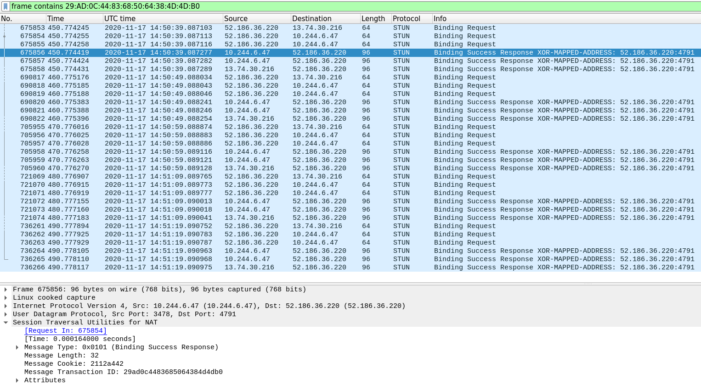
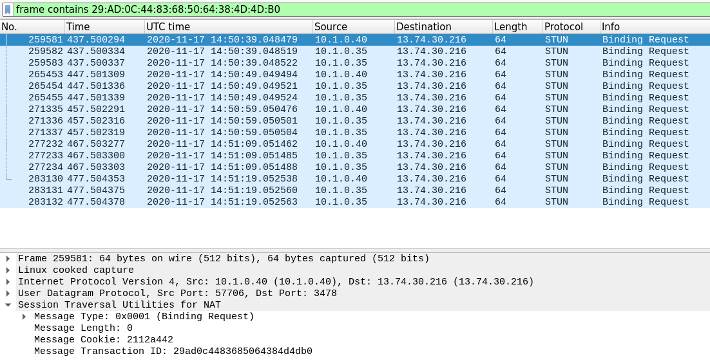

# STUN tester

This repository contains a simple STUN server and a STUN client test tool used
to debug issues with lost STUN response on Microsoft Azure. Specifically,
multiple consecutive STUN responses are sent from an AKS cluster and are
observed on the network capture from the AKS virtual machine node, but they
never reach the STUN client.

## Deploying the STUN server

To deploy the STUN server, first switch context to your AKS cluster where the
server should run. Then update the `loadBalancerIP` in the [service
manifest](stun_server/kubernetes/stun-server-svc.yaml). If you already have a
static IP, you can use that one, otherwise, you can remove the line and let AKS
assign it a public IP address. Then you can deploy the STUN server deployment
and service:

    kubectl create -f stun_server/kubernetes

## Deploying the STUN client test tool

First switch context to the intended AKS cluster. Then update the
`STUN_SERVER_IP` environment variable in the [deployment
manifest](stun_client/kubernetes/stun-client-deployment.yaml) to match the
public IP given to the STUN server. Then you can deploy the STUN server
deployment and service:

    kubectl create -f stun_client/kubernetes

By default, the client only logs warnings and errors. To tail the client logs, run:

    kubectl logs -f -l app=stun-client

Eventually, you might see an output like:

    14:43:48.572 [warn]  Client 65: Failed to receive STUN response for TrID "93:26:E2:A7:CD:0B:C9:CF:63:98:D1:9B", mapped addr: 52.186.36.220:4171
    14:45:00.340 [warn]  Client 907: Failed to receive STUN response for TrID "E8:C8:1F:4A:B1:54:77:CF:89:4E:4B:37", mapped addr: 52.151.241.15:16920
    14:47:01.521 [warn]  Client 907: Failed to receive STUN response for TrID "E2:B2:A0:B7:28:86:65:69:0C:02:36:C7", mapped addr: 52.186.36.174:19106
    14:48:44.821 [warn]  Client 8: Failed to receive STUN response for TrID "DA:DD:D8:3E:CB:C1:DC:6D:B9:E3:0A:5D", mapped addr: 52.186.36.220:1355
    14:49:07.869 [warn]  Client 98: Failed to receive STUN response for TrID "6C:4C:24:65:17:70:F0:56:A7:87:FC:F1", mapped addr: 52.186.32.168:4284
    14:49:10.636 [warn]  Client 274: Failed to receive STUN response for TrID "F2:E8:8D:3F:AB:74:23:0A:24:59:E5:9C", mapped addr: :
    14:49:20.637 [warn]  Client 274: Failed to receive STUN response for TrID "F2:E8:8D:3F:AB:74:23:0A:24:59:E5:9C", mapped addr: :
    14:49:30.638 [warn]  Client 274: Failed to receive STUN response for TrID "F2:E8:8D:3F:AB:74:23:0A:24:59:E5:9C", mapped addr: :
    14:49:40.639 [warn]  Client 274: Failed to receive STUN response for TrID "F2:E8:8D:3F:AB:74:23:0A:24:59:E5:9C", mapped addr: :
    14:49:50.640 [error] Client 274: Failed to receive 5 consecutive STUN response for TrID "F2:E8:8D:3F:AB:74:23:0A:24:59:E5:9C", mapped addr: :
    14:50:49.049 [warn]  Client 474: Failed to receive STUN response for TrID "29:AD:0C:44:83:68:50:64:38:4D:4D:B0", mapped addr: :
    14:50:59.050 [warn]  Client 474: Failed to receive STUN response for TrID "29:AD:0C:44:83:68:50:64:38:4D:4D:B0", mapped addr: :
    14:51:09.051 [warn]  Client 474: Failed to receive STUN response for TrID "29:AD:0C:44:83:68:50:64:38:4D:4D:B0", mapped addr: :
    14:51:19.052 [warn]  Client 474: Failed to receive STUN response for TrID "29:AD:0C:44:83:68:50:64:38:4D:4D:B0", mapped addr: :
    14:51:29.053 [error] Client 474: Failed to receive 5 consecutive STUN response for TrID "29:AD:0C:44:83:68:50:64:38:4D:4D:B0", mapped addr: :

## Network captures

In the test where the above logs came from, network captures were taken on the
client and server AKS cluster VM nodes:

    tcpdump -i any -G 3600 'port 3478' -w ./pcaps/dump_%y%m%d_%H.pcap

Examining the captures and filtering on the failed transactions ID from the logs

    frame contains 29:AD:0C:44:83:68:50:64:38:4D:4D:B0

we observe that the server sent all 5 STUN responses, but none of them reached
the client. The server capture:

The client capture:

